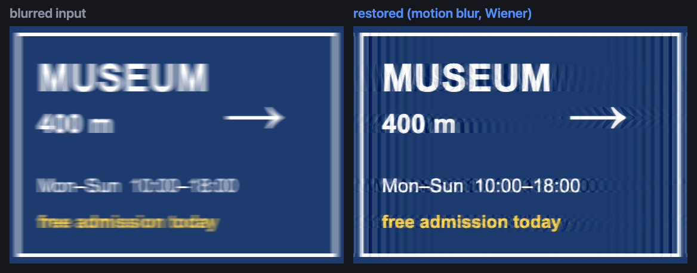
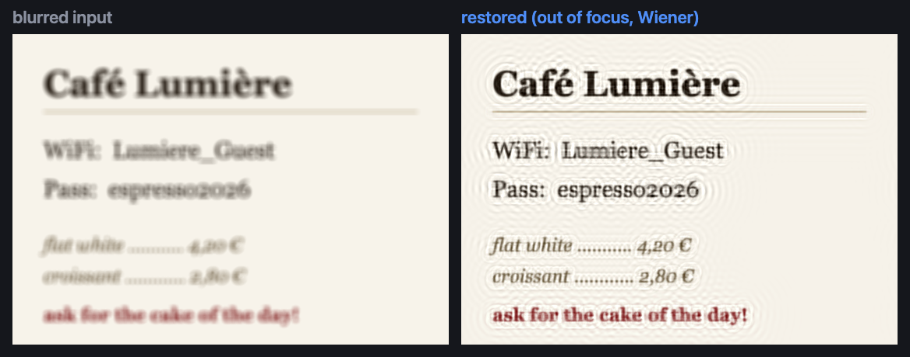

# Mathematical Deblur

**A blurry photo is not a lost photo.** Most blur — a missed focus, a shaky
hand — doesn't destroy the information in an image; it just smears it in a
mathematically predictable way. If you can describe the smear, you can largely
undo it. This app does exactly that, entirely in your browser. No upload, no
server, no AI hallucinating pixels that were never there — just classical
deconvolution recovering what the light actually recorded.


**➡️ Try it live: [tn1ck.github.io/mathematical-deblur](https://tn1ck.github.io/mathematical-deblur/)**

By [Tom Nick](https://tn1ck.com), based on the excellent
[SmartDeblur](https://github.com/y-vladimir/smartdeblur) by Vladimir Yuzhikov.

## Examples

A photo smeared by **camera shake** — 14 px of horizontal motion blur.
The opening hours are illegible before, readable after:



A **missed-focus** shot of a café card — the WiFi password comes back:



Both restorations were produced by this app with the matching defect model
(a line PSF and a disc PSF respectively). The faint ripples are ringing —
the honest fingerprint of frequency-domain deconvolution; the Total
Variation mode reduces them further.

## When you want this

- **A document photo that missed focus** — receipts, whiteboards, slides,
  book pages, labels. Text is high-contrast and structured, which makes it
  the single best case for deconvolution: even heavily defocused text often
  snaps back to readable.
- **Camera shake in a straight line** — the classic smeared night shot.
  Model it as motion blur, dial in length and angle, and edges fold back
  together.
- **Softness you can't explain** — scans, old digitized photos, frames from
  video. The Gaussian model handles generic mild blur.
- **You care where the pixels come from.** Unlike ML upscalers, every output
  pixel here is computed from your input by an explicit, inspectable formula.
  Nothing is invented — which matters when the content has to be *true*
  (a serial number, a date on a slide, a measurement readout).

And because everything runs locally, it's fine to use on images you wouldn't
upload to a random "enhance" website.

### When it won't help

Deconvolution inverts *uniform* blur. It cannot recover what was never
captured:

- portrait-style background bokeh (blur varies with depth),
- rotational or curved shake (the kernel isn't a straight line),
- heavy JPEG artifacts or strong noise (the "smooth" slider trades detail
  against amplifying them),
- extreme blur, where the signal is genuinely below the noise floor.

## The math behind it

A blurred image $g$ is the sharp image $f$ convolved with a **point spread
function** ([PSF](https://en.wikipedia.org/wiki/Point_spread_function)) $h$,
plus noise $n$:

$$g = h * f + n$$

Convolution becomes multiplication in the frequency domain
($G = H \cdot F + N$), so the naive fix is $\hat F = G / H$ — which explodes
wherever $H$ is small, amplifying noise into garbage. Every practical method
is a smarter way to regularize that division. This app implements three,
ported from SmartDeblur's engine:

- **[Wiener deconvolution](https://en.wikipedia.org/wiki/Wiener_deconvolution)** —
  the fast preview. Dampens the inversion by an estimate of the
  noise-to-signal ratio $K$:

$$\hat F = \frac{H}{|H|^2 + K}\, G$$

- **[Tikhonov regularization](https://en.wikipedia.org/wiki/Ridge_regression#Tikhonov_regularization)** —
  like Wiener, but the penalty is weighted by the spectrum of the discrete
  Laplacian, so smoothing concentrates where the image is smooth and edges
  stay crisp.
- **[Total Variation prior](https://en.wikipedia.org/wiki/Total_variation_denoising)** —
  the high-quality mode. Minimizes
  $\lVert h * f - g \rVert^2 + \lambda \lVert \nabla f \rVert_1$
  by gradient descent (500 iterations by default). The TV term prefers
  piecewise-smooth images with sharp edges — exactly what photographs are —
  and visibly reduces the ringing that pure frequency-domain methods leave
  around edges.

The PSF itself is built from your slider settings: an antialiased **disc**
for out-of-focus blur (with a tunable Gaussian edge ring, since real lens
bokeh isn't a perfect cylinder), a **line** for motion blur, a **Gaussian**
for generic softness. A border-substitution trick suppresses the wrap-around
ringing that FFT-based filtering otherwise produces at image edges.

Vladimir Yuzhikov's articles are the best deep dive into all of this —
they're what the original tool was built on:

- [Restoration of defocused and blurred images, part 1 — Theory](https://yuzhikov.com/articles/BlurredImagesRestoration1.htm)
- [Restoration of defocused and blurred images, part 2 — Practice](https://yuzhikov.com/articles/BlurredImagesRestoration2.htm)

## Using it

1. Drop in an image (downscaled to 3 MP if larger).
2. Pick the defect type and **slowly raise the radius**. The image will look
   worse, worse, worse — then suddenly *snap* when the radius matches the
   real blur. Overshooting produces ghost ringing; back off until it's gone.
3. Use **Smooth** to trade detail against noise amplification, and the
   kernel preview to sanity-check what PSF you're asking it to invert.
4. When the preview looks right, run **High quality (Total Variation)** for
   the final result, then save it.

Dragging sliders gives an instant grayscale preview; releasing renders in
color. Hold *compare* to flip back to the original.

## Development

The deconvolution engine lives in `rust-core/` (`fft2d.rs` — 2D real FFT,
`kernel.rs` — PSF construction, `deconvolution.rs` — the three methods) and
runs inside a web worker, so the UI in `web/` never blocks.

Prerequisites: Rust with the `wasm32-unknown-unknown` target,
[wasm-pack](https://rustwasm.github.io/wasm-pack/), Node.js.

```sh
cd rust-core
wasm-pack build --target web --release   # build the engine
cargo test                               # engine unit tests

cd ../web
npm install
npm run dev                              # development server
npm run build                            # production build in web/dist
```

An end-to-end browser check lives in `web/verify.mjs` (expects the dev
server on port 5179; uses Playwright).

## License

GPL v3, same as the original — see [LICENSE](LICENSE).

This project is a derived work of SmartDeblur 1.27, Copyright (C)
Vladimir Yuzhikov (yuvladimir@gmail.com). The deconvolution algorithms and
kernel models are ported from its `src/DeconvolutionTool.cpp` and
`src/ImageUtils.cpp`; the engine is reimplemented in Rust and the UI is new.
